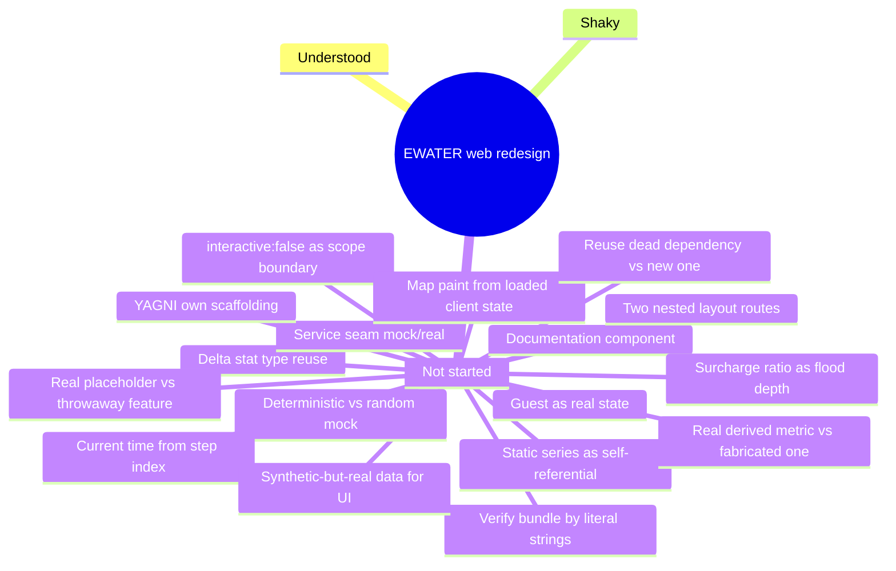

# Learning Log — web redesign

Current phase: Phase 2 — Bản đồ GIS (Tab 2) (see [tasks/INDEX.md](../tasks/INDEX.md)); Phase 0 and Phase 1 complete

Scoped to the **web redesign** initiative (`web/src` → Urban Flood Digital Twin
sidebar UI). Concepts already covered by the pre-existing EWATER build (MapLibre
basics, GeoJSON, Supabase auth, zustand, recharts) aren't re-logged here unless
a task pushes them further than before.

## Concepts & Knowledge

| Concept | Status | Last touched | Notes |
|---|---|---|---|
| Shared "delta stat" type reuse (`DeltaStat`/`ScenarioImpactResult`) | not-started | 2026-07-20 | One shared shape (`value`+`delta`) for every "+Δ" stat card across Dashboard/Forecast/What-if/Impact, and one shared 4-metric bundle (`ScenarioImpactResult`) reused by forecast/whatif/impact services since they're all views onto the same underlying flood-impact numbers. See [P0-01 report](learn-log/P0-01-extend-types.md) §4. |
| Mock/real "service seam" (fixed signature, swappable body) | not-started | 2026-07-20 | `web/src/data/*.ts` fixes each page's data-access function signature now (typed args/return) while the body is a mock or a `throw` placeholder — a future real backend swap touches one file, not every caller. See [P0-02 report](learn-log/P0-02-data-service-skeleton.md) §4. |
| "No session" as a real supported state (guest) | not-started | 2026-07-20 | `session == null` used to mean "loading/must log in"; the new access model treats it as a legitimate third tier (Guest, view-only Dashboard access) — no context shape change needed, only how routes interpret it. See [P0-04 report](learn-log/P0-04-auth-2-roles.md) §4. |
| "Documentation component" (renders unconditionally, on purpose) | not-started | 2026-07-20 | `RequireGuestOrRole` does nothing at runtime — its value is making "this route is deliberately open" legible at the route definition, vs. an unguarded route reading as possibly-forgotten. See [P0-05 report](learn-log/P0-05-require-role-guards.md) §4. |
| Two independent nested React Router layout routes (shell vs. auth gate) | not-started | 2026-07-20 | `AppShell` (Sidebar+TopBar+`<Outlet/>`) wraps *every* route, `RequireAuth` (auth gate) nests *inside* it but only around the routes that need it — `/` sits as AppShell's direct child, skipping the gate. Two concerns that used to be one wrapper are now two composable layers. See [P0-10 report](learn-log/P0-10-appshell-router.md) §4. |
| YAGNI applied to your own recent scaffolding, not just old code | not-started | 2026-07-20 | Deleted a `data/` service-skeleton built earlier *this same session* specifically for future phases to fill in — "I understand why it's unused" isn't the same claim as "it's not unused." See [P0-16 report](learn-log/P0-16-delete-unused-reverse-scaffold-policy.md) §4. |
| Verify bundle contents by a library's own literal strings | not-started | 2026-07-20 | Chunk size numbers alone couldn't prove recharts was/wasn't bundled (Supabase's sub-clients are legitimately large too) — grepping the output for recharts' `recharts-` CSS class prefix (survives minification as a runtime string) gave an unambiguous answer. See [P0-16 report](learn-log/P0-16-delete-unused-reverse-scaffold-policy.md) §4/§6. |
| Surcharge ratio (>1.0) as flood depth above ground | not-started | 2026-07-20 | `simulation.nodeFill` is a 0..1.2 pipe-fill ratio, not capped at 1.0 — values past the `surcharge` threshold mean water backing up above ground, so a derived water-level formula (`invert + fill*(ground-invert)`) legitimately exceeding `groundLevel` is correct physical behavior, not a bug to clamp. See [P1-01 report](learn-log/P1-01-dashboard-service.md) §4. |
| Deterministic mock vs. random mock for untyped source fields | not-started | 2026-07-20 | When a field genuinely doesn't exist in the source data (`outlets.geojson` has no pump/gate type), mock it as a fixed function of a stable input (muid parity) instead of `Math.random()`, so the same record doesn't flip category every render/reload. See [P1-01 report](learn-log/P1-01-dashboard-service.md) §4. |
| Deriving "current time" from a step index | not-started | 2026-07-22 | The simulation is a fixed array of steps (`start` + `stepMinutes`×index), not wall-clock time — a page needing "now" must compute it from step data, not read `new Date()`. See [P1-02 report](learn-log/P1-02-dashboard-header-stats.md) §4. |
| Real placeholder over inventing a missing feature | not-started | 2026-07-22 | Dashboard needs a "current step" but the shared playback control doesn't exist until P2-01 — used the last real step instead of building a throwaway step-picker that would duplicate/preempt that later task. See [P1-02 report](learn-log/P1-02-dashboard-header-stats.md) §4. |
| `interactive: false` as a deliberate scope boundary | not-started | 2026-07-22 | The Dashboard's flood-map card is a static MapLibre preview, not a competing implementation of Phase 2's full interactive map — `interactive: false` disables all input handlers in one flag, keeping the component from organically growing toolbar/layer features that belong to P2-03. See [P1-03 report](learn-log/P1-03-flood-map-preview.md) §4. |
| Deriving map paint from already-loaded client state | not-started | 2026-07-22 | Manhole marker color by flood severity isn't a Supabase column — it's computed per step from `AppData.simulation.nodeFill` (already loaded by P0-19) via a cloned GeoJSON `FeatureCollection` + a MapLibre `match` paint expression, avoiding a redundant second query for data the page already has in memory. See [P1-03 report](learn-log/P1-03-flood-map-preview.md) §4. |
| Static demo series treated as self-referential, not wall-clock-aligned | not-started | 2026-07-22 | `rain-forecast.json` is a fixed 72h snapshot from a specific generation date — its timestamps don't line up with real "now". Index 0 (`generatedAt`) is used as the series' own reference point instead of trying to align it to live time, same placeholder pattern as the simulation step. See [P1-05 report](learn-log/P1-05-weather-forecast-card.md) §4. |
| Replacing a fabricated metric with a real derived one | not-started | 2026-07-22 | Instead of inventing a "% xác suất mưa lớn" figure with no data source, count real hours with `precipitation > 0` in the next 24h and show that instead — smaller number, but every digit traces to real data. See [P1-05 report](learn-log/P1-05-weather-forecast-card.md) §4. |
| Reusing a "dead" dependency instead of adding a new one | not-started | 2026-07-22 | `recharts` was already in `package.json`, unused since P0-16's cleanup — checked existing tooling before reaching for a new charting library, same move as reactivating `maplibre-gl` in P1-03. See [P1-06 report](learn-log/P1-06-forecast-charts.md) §4. |
| Documented-synthetic data treated as real for UI purposes | not-started | 2026-07-22 | `tide-demo.json`'s own `note` field says it's synthetic (no real gauge), but the chart still treats `tide.levelM` as real Supabase-row data — the distinction that matters is "real query vs. invented number," not "synthetic origin vs. real-world origin." See [P1-06 report](learn-log/P1-06-forecast-charts.md) §4. |

Status values: `not-started`, `shaky`, `understood`.

## Mind Map

