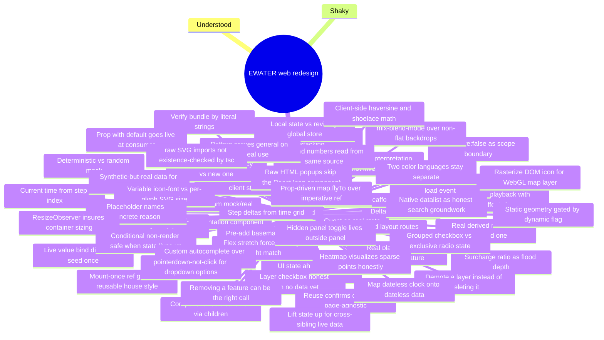

# Learning Log — web redesign

Current phase: Phase 3 — Quan trắc thời gian thực (Tab 3) (see [tasks/INDEX.md](../tasks/INDEX.md)); Phase 0, Phase 1, Phase 2 complete

Scoped to the **web redesign** initiative (`web/src` → Urban Flood Digital Twin
sidebar UI). Concepts already covered by the pre-existing EWATER build (MapLibre
basics, GeoJSON, Supabase auth, zustand, recharts) aren't re-logged here unless
a task pushes them further than before.

## Concepts & Knowledge

| Concept | Status | Last touched | Notes |
|---|---|---|---|
| Shared "delta stat" type reuse (`DeltaStat`/`ScenarioImpactResult`) | not-started | 2026-07-20 | One shared shape (`value`+`delta`) for every "+Δ" stat card across Dashboard/Forecast/What-if/Impact, and one shared 4-metric bundle (`ScenarioImpactResult`) reused by forecast/whatif/impact services since they're all views onto the same underlying flood-impact numbers. See [P0-01 report](learn-log/P0-01-extend-types.md) §4. |
| Mock/real "service seam" (fixed signature, swappable body) | not-started | 2026-07-20 | `web/src/data/*.ts` fixes each page's data-access function signature now (typed args/return) while the body is a mock or a `throw` placeholder — a future real backend swap touches one file, not every caller. See [P0-02 report](learn-log/P0-02-data-service-skeleton.md) §4. |
| "No session" as a real supported state (guest) | not-started | 2026-07-20 | `session == null` used to mean "loading/must log in"; the new access model treats it as a legitimate third tier (Guest, view-only Dashboard access) — no context shape change needed, only how routes interpret it. See [P0-04 report](learn-log/P0-04-auth-2-roles.md) §4. |
| "Documentation component" (renders unconditionally, on purpose) | not-started | 2026-07-20 | `RequireGuestOrRole` does nothing at runtime — its value is making "this route is deliberately open" legible at the route definition, vs. an unguarded route reading as possibly-forgotten. See [P0-05 report](learn-log/P0-05-require-role-guards.md) §4. |
| Two independent nested React Router layout routes (shell vs. auth gate) | not-started | 2026-07-20 | `AppShell` (Sidebar+TopBar+`<Outlet/>`) wraps *every* route, `RequireAuth` (auth gate) nests *inside* it but only around the routes that need it — `/` sits as AppShell's direct child, skipping the gate. Two concerns that used to be one wrapper are now two composable layers. See [P0-10 report](learn-log/P0-10-appshell-router.md) §4. |
| YAGNI applied to your own recent scaffolding, not just old code | not-started | 2026-07-20 | Deleted a `data/` service-skeleton built earlier *this same session* specifically for future phases to fill in — "I understand why it's unused" isn't the same claim as "it's not unused." See [P0-16 report](learn-log/P0-16-delete-unused-reverse-scaffold-policy.md) §4. |
| Verify bundle contents by a library's own literal strings | not-started | 2026-07-20 | Chunk size numbers alone couldn't prove recharts was/wasn't bundled (Supabase's sub-clients are legitimately large too) — grepping the output for recharts' `recharts-` CSS class prefix (survives minification as a runtime string) gave an unambiguous answer. See [P0-16 report](learn-log/P0-16-delete-unused-reverse-scaffold-policy.md) §4/§6. |
| Surcharge ratio (>1.0) as flood depth above ground | not-started | 2026-07-20 | `simulation.nodeFill` is a 0..1.2 pipe-fill ratio, not capped at 1.0 — values past the `surcharge` threshold mean water backing up above ground, so a derived water-level formula (`invert + fill*(ground-invert)`) legitimately exceeding `groundLevel` is correct physical behavior, not a bug to clamp. See [P1-01 report](learn-log/P1-01-dashboard-service.md) §4. |
| Deterministic mock vs. random mock for untyped source fields | not-started | 2026-07-20 | When a field genuinely doesn't exist in the source data (`outlets.geojson` has no pump/gate type), mock it as a fixed function of a stable input (muid parity) instead of `Math.random()`, so the same record doesn't flip category every render/reload. See [P1-01 report](learn-log/P1-01-dashboard-service.md) §4. |
| Deriving "current time" from a step index | not-started | 2026-07-22 | The simulation is a fixed array of steps (`start` + `stepMinutes`×index), not wall-clock time — a page needing "now" must compute it from step data, not read `new Date()`. See [P1-02 report](learn-log/P1-02-dashboard-header-stats.md) §4. |
| Real placeholder over inventing a missing feature | not-started | 2026-07-22 | Dashboard needs a "current step" but the shared playback control doesn't exist until P2-01 — used the last real step instead of building a throwaway step-picker that would duplicate/preempt that later task. See [P1-02 report](learn-log/P1-02-dashboard-header-stats.md) §4. |
| `interactive: false` as a deliberate scope boundary | not-started | 2026-07-22 | The Dashboard's flood-map card is a static MapLibre preview, not a competing implementation of Phase 2's full interactive map — `interactive: false` disables all input handlers in one flag, keeping the component from organically growing toolbar/layer features that belong to P2-03. See [P1-03 report](learn-log/P1-03-flood-map-preview.md) §4. |
| Deriving map paint from already-loaded client state | not-started | 2026-07-22 | Manhole marker color by flood severity isn't a Supabase column — it's computed per step from `AppData.simulation.nodeFill` (already loaded by P0-19) via a cloned GeoJSON `FeatureCollection` + a MapLibre `match` paint expression, avoiding a redundant second query for data the page already has in memory. See [P1-03 report](learn-log/P1-03-flood-map-preview.md) §4. |
| Static demo series treated as self-referential, not wall-clock-aligned | not-started | 2026-07-22 | `rain-forecast.json` is a fixed 72h snapshot from a specific generation date — its timestamps don't line up with real "now". Index 0 (`generatedAt`) is used as the series' own reference point instead of trying to align it to live time, same placeholder pattern as the simulation step. See [P1-05 report](learn-log/P1-05-weather-forecast-card.md) §4. |
| Replacing a fabricated metric with a real derived one | not-started | 2026-07-22 | Instead of inventing a "% xác suất mưa lớn" figure with no data source, count real hours with `precipitation > 0` in the next 24h and show that instead — smaller number, but every digit traces to real data. See [P1-05 report](learn-log/P1-05-weather-forecast-card.md) §4. |
| Reusing a "dead" dependency instead of adding a new one | not-started | 2026-07-22 | `recharts` was already in `package.json`, unused since P0-16's cleanup — checked existing tooling before reaching for a new charting library, same move as reactivating `maplibre-gl` in P1-03. See [P1-06 report](learn-log/P1-06-forecast-charts.md) §4. |
| Documented-synthetic data treated as real for UI purposes | not-started | 2026-07-22 | `tide-demo.json`'s own `note` field says it's synthetic (no real gauge), but the chart still treats `tide.levelM` as real Supabase-row data — the distinction that matters is "real query vs. invented number," not "synthetic origin vs. real-world origin." See [P1-06 report](learn-log/P1-06-forecast-charts.md) §4. |
| Absolute-positioned sibling stacking without explicit `z-index` | not-started | 2026-07-22 | An abspos element paints above its non-positioned in-flow siblings by default — but adding `z-index` to *either* sibling overrides that default, so a fix aimed at one element (input caret) can silently hide an unrelated one (its icon) if the ordering isn't re-checked. See [Follow-up report](learn-log/FOLLOWUP-2026-07-22-login-dashboard-polish.md) §4. |
| `mix-blend-mode` breaks over non-flat backdrops | not-started | 2026-07-22 | `multiply` composites against whatever's underneath, so a logo that looked fine over a flat page background looked dim/muddy over a translucent, blurred-photo glass card — replacing it with an opaque backing shape makes brightness independent of the backdrop. See [Follow-up report](learn-log/FOLLOWUP-2026-07-22-login-dashboard-polish.md) §4. |
| Variable icon-font vs. per-glyph SVG bundle size | not-started | 2026-07-22 | A ligature-based icon font (`material-symbols`) bundles every glyph in the set (~4MB) regardless of usage; per-glyph SVG imports (`@material-symbols/svg-400`, via Vite's `?raw`) only bundle what's actually imported — caught by reading `npm run build`'s asset sizes, not by any build failure. See [Follow-up report](learn-log/FOLLOWUP-2026-07-22-icon-font-system.md) §4/§6. |
| Interval-driven playback (`setInterval` inside `useEffect` + cleanup) | not-started | 2026-07-23 | "Play" auto-advances a step counter on a timer started in `useEffect`; the effect's cleanup (`clearInterval`) fires whenever `playing`/`speed` changes or the component unmounts, so no stray timer keeps ticking after pause/navigation. See [P2-01 report](learn-log/P2-01-gis-topbar-playback.md) §4. |
| Step deltas from a time grid, not a fixed step count | not-started | 2026-07-23 | The GIS map's `+3h` button means "+3 hours," converted via `60 / stepMinutes` into however many steps that is right now — hardcoding "+3h = +12 steps" would silently break if `stepMinutes` ever changed. See [P2-01 report](learn-log/P2-01-gis-topbar-playback.md) §4. |
| Per-page local state instead of reviving a deleted global store | not-started | 2026-07-23 | The old design had a shared `state/store.ts` for playback step; P0-16 deleted it and the current policy is not to pre-build shared infrastructure for a consumer that doesn't exist yet — GIS map's step state stays local to `GisMap.tsx` until a second page genuinely needs to share it. See [P2-01 report](learn-log/P2-01-gis-topbar-playback.md) §3/§5. |
| UI state can be honestly ahead of its data source | not-started | 2026-07-23 | The GIS layer panel's basemap radio has 2 options ("light", "Google Satellite") with no real tile source configured yet — kept as real, selectable state with an inline "(coming soon)" marker instead of fabricating a Google tile URL or a fake light-style basemap just to make all 4 mockup options look equally real. See [P2-02 report](learn-log/P2-02-gis-layer-panel.md) §4. |
| Grouped checkbox state vs. exclusive radio state in one component | not-started | 2026-07-23 | Independently-togglable layers use `Record<key, boolean>`; the single-choice basemap uses one string value + native `<input type=radio name=...>` grouping — conflating the two (e.g. 4 basemap booleans) would let zero or multiple basemaps be "selected" at once. See [P2-02 report](learn-log/P2-02-gis-layer-panel.md) §4. |
| Pre-add both raster basemap layers, toggle visibility instead of `setStyle()` | not-started | 2026-07-23 | `map.setStyle()` rebuilds the whole style and drops custom sources/layers (flood zones, manholes, measurement lines) — instead both `basemap-osm`/`basemap-satellite` raster layers are added once, and switching basemaps just flips `visibility`. Also resolves P2-02's 4-labels-2-real-sources gap by mapping all 4 UI choices onto whichever real layer is the closer match. See [P2-03 report](learn-log/P2-03-gis-map-canvas.md) §4. |
| Client-side haversine/shoelace math instead of a mapping-library dependency | not-started | 2026-07-23 | "Measure distance"/"measure area" are ~15 lines of geometry math (great-circle distance sum, locally-projected shoelace polygon area) in `web/src/lib/geo.ts` — accurate enough at city-block scale, no `maplibre-gl-draw`/`turf` dependency added for 2 formulas. See [P2-03 report](learn-log/P2-03-gis-map-canvas.md) §4. |
| A map layer checkbox can exist honestly with nothing rendered behind it yet | not-started | 2026-07-23 | `rainStation` and the 3 forecast-group checkboxes toggle real state but the map renders nothing for them — no per-station rain-gauge geometry or predicted-flood-extent polygon exists in Supabase yet; documented inline rather than faked with invented markers/polygons. See [P2-03 report](learn-log/P2-03-gis-map-canvas.md) §4. |
| Static geometry gated by a dynamic per-step flag | not-started | 2026-07-23 | `flood_zones` polygons are a fixed shape for the whole simulation run, but whether a zone counts toward "Diện tích ngập" depends on its per-step `severity[step] > 0` — using the shape alone would show the same area at every step, including dry ones. See [P2-04 report](learn-log/P2-04-gis-right-panel.md) §4. |
| Reusing an existing depth interpretation instead of inventing a second one | not-started | 2026-07-23 | "Độ sâu TB"/"Độ sâu lớn nhất" reuse `dashboardService.ts`'s `(fill-1)*(ground-invert)` = depth-above-ground formula (already established for `maxWaterLevel`), averaged/maxed over every currently-surcharged manhole — one definition of "flood depth" across the app, not two that could drift. See [P2-04 report](learn-log/P2-04-gis-right-panel.md) §4. |
| A prop with a default becomes live once its real consumer lands | not-started | 2026-07-23 | `GisMapCanvas`'s `floodOpacity` prop (P2-03, with a sensible default) needed zero internal changes when P2-04's opacity slider became its real caller-supplied value — confirms naming a forward-compatible seam ahead of its consumer (not ahead of need) paid off. See [P2-04 report](learn-log/P2-04-gis-right-panel.md) §4. |
| Reusing a component unchanged confirms it was already page-agnostic | not-started | 2026-07-23 | `RainForecastChart`/`WaterLevelForecastChart` (built for Dashboard in P1-06) dropped into `/gis-map`'s bottom panel with zero modification — same props, same styling classes — proving they never had hidden Dashboard-only coupling to begin with. See [P2-05 report](learn-log/P2-05-gis-bottom-panel.md) §4. |
| A placeholder that names the concrete reason, not a vague timeline | not-started | 2026-07-23 | `GisCameraCard`'s coming-soon message says camera data ships once Phase 6's structures/operations registry exists, instead of a generic "sắp ra mắt" — costs nothing to state and is more honest about what's actually missing. See [P2-05 report](learn-log/P2-05-gis-bottom-panel.md) §4. |
| A map needs a style before it can have a `load` event | not-started | 2026-07-23 | Omitting MapLibre's `style` option entirely (not just "still loading") means there's nothing to load at all, so `load` never fires and any handler waiting on it never runs — `GisMapCanvas.tsx` had this bug while the app's other 2 map components (which always pass a real style) didn't. See [blank-map fix report](learn-log/FOLLOWUP-2026-07-23-blank-gis-map-fix.md) §4. |
| `ResizeObserver` as insurance against a map's one-time size measurement | not-started | 2026-07-23 | MapLibre reads its container's size once at construction; a flex layout not yet settled at that instant can leave the canvas born at 0×0 forever. Wasn't the actual bug this time, but added to all 3 map components as a real, independent defensive fix. See [blank-map fix report](learn-log/FOLLOWUP-2026-07-23-blank-gis-map-fix.md) §4. |
| A native heatmap as an honest way to visualize sparse real points densely | not-started | 2026-07-23 | The GIS map's flood layer went from 2 flat convex-hull polygons to a MapLibre `heatmap` weighted by all 834 real manhole fill values — dense-looking without inventing a fake fine grid the simulation never actually computed. See [flood heatmap report](learn-log/FOLLOWUP-2026-07-23-flood-heatmap.md) §4. |
| Two color languages (point severity vs. area density) must stay visually separate | not-started | 2026-07-23 | The new flood heatmap uses a blue-only ramp instead of reusing the app's green/orange/red per-point severity scheme, so "how much of this area is flooded" can't be misread as "this whole area is at danger level." See [flood heatmap report](learn-log/FOLLOWUP-2026-07-23-flood-heatmap.md) §4. |
| Demoting a layer instead of deleting it | not-started | 2026-07-23 | `flood_zones`' 2 coarse polygons stayed on the map as a thin fixed-opacity outline (not deleted) once the heatmap became primary, and their centroids were reused to place new warning markers — still-real data kept earning its keep instead of being thrown away. See [flood heatmap report](learn-log/FOLLOWUP-2026-07-23-flood-heatmap.md) §4. |
| Mapping a dateless real clock onto a data array with no calendar dates | not-started | 2026-07-23 | `simulation.nodeFill` has no calendar date, just a fixed 24h cycle — `currentSimStep()` maps `new Date()`'s hour:minute onto that cycle, a real lookup of already-simulated data (not another fabricated placeholder), at the cost of repeating every 24h with no way to distinguish "today" from "yesterday." See [live-now report](learn-log/FOLLOWUP-2026-07-23-live-now-time.md) §4. |
| A live value needs each consumer to decide bind-directly vs. seed-once | not-started | 2026-07-23 | `useCurrentSimStep()`'s live value is bound directly to Dashboard's `step` (no manual control there) but only seeds `/gis-map`'s initial `useState` + feeds a separate live `baselineStep` prop — binding `/gis-map`'s actual step directly would yank the view out from under a user mid-scrub every minute. See [live-now report](learn-log/FOLLOWUP-2026-07-23-live-now-time.md) §4. |
| Cross-sibling live data needs lift-state-up, not a shared map instance | not-started | 2026-07-23 | `GisMapCanvas` and `GisRightPanel`'s minimap are sibling components, each owning an independent MapLibre `Map` — neither can call methods on the other directly, so the main map reports bounds *up* via an `onBoundsChange` callback, the parent holds it in state, and passes it back *down* to the minimap as a prop, same flow already used for `floodOpacity`. See [minimap/legend/icons report](learn-log/FOLLOWUP-2026-07-23-minimap-legend-icons.md) §4. |
| Rasterizing a DOM icon for a WebGL map layer | not-started | 2026-07-23 | The app's `Icon` component colors SVGs via CSS `fill: currentColor`, inherited from the DOM — that trick doesn't survive rasterizing the same SVG into a static image for MapLibre's `icon-image`, so the fill has to be string-injected into the raw SVG *before* converting it to a data-URI `Image()` and `map.addImage()`-ing it. See [minimap/legend/icons report](learn-log/FOLLOWUP-2026-07-23-minimap-legend-icons.md) §4. |
| A legend's numbers must read from the same source as what they describe | not-started | 2026-07-23 | The flood-severity legend's new `%` ranges read directly from `data.config.simThresholds` — the same object `fillState()` already uses to color markers — instead of a second hardcoded `70`/`100` typed into the JSX that could silently go stale. See [minimap/legend/icons report](learn-log/FOLLOWUP-2026-07-23-minimap-legend-icons.md) §4. |
| Flex row `align-items: stretch` forces siblings to match the tallest one's height | not-started | 2026-07-23 | `.gis-right-panel` was one flex item in `.gis-body`, a row with the default `align-items: stretch`, so its height matched `.gis-main-area`'s 560px map even though its own 3 sections' content was far shorter — the leftover height rendered as visible dead space. Fixed with `align-items: flex-start` on `.gis-body` plus splitting the one card into 3 independent auto-height `.gis-right-card` boxes. See [layer-panel-toggle report](learn-log/FOLLOWUP-2026-07-23-layer-panel-toggle-right-cards.md) §4. |
| A hide-by-default panel's toggle must live outside the panel it controls | not-started | 2026-07-23 | `GisLayerPanel` now starts hidden (`showLayerPanel` defaults `false` in `GisMap.tsx`) — the toggle button can't be rendered *by* `GisLayerPanel` itself, since a control inside a hidden component can never be clicked to unhide it; it has to be an always-rendered sibling in `.gis-body`. See [layer-panel-toggle report](learn-log/FOLLOWUP-2026-07-23-layer-panel-toggle-right-cards.md) §4. |
| A component can host a caller's floating UI via `children` without knowing what it is | not-started | 2026-07-23 | `GisMapCanvas.tsx` gained an optional `children` prop rendered inside its own `.gis-canvas-wrapper` (already `position: relative`, the same context every other floating control there anchors to) — `GisMap.tsx` passes the layer-panel toggle + panel as children instead of reaching into `GisMapCanvas`'s own JSX, keeping the layer-panel state exactly where it already lived. See [map-first-layout report](learn-log/FOLLOWUP-2026-07-23-map-first-layout.md) §4. |
| Removing a feature can be the right answer, not just redesigning it | not-started | 2026-07-23 | Offered to rebuild the minimap around a moving-background/fixed-frame design matching what the user described; the user chose outright deletion instead once the layer panel became a floating overlay — `viewBounds`/`onBoundsChange` plumbing was deleted end-to-end rather than left dormant, per the project's P0-16 delete-unused-code policy. See [map-first-layout report](learn-log/FOLLOWUP-2026-07-23-map-first-layout.md) §4. |
| A pattern proves itself general on its 2nd real use, not its 1st | not-started | 2026-07-23 | The `GisMapCanvas` `children`-overlay mechanism built for the left layer panel was reused as-is for the right info panel with no new abstraction needed — confirming it was a real generalization (map-canvas-owns-the-floating-slot) rather than something that happened to fit one specific panel. See [right-panel-overlay report](learn-log/FOLLOWUP-2026-07-23-right-panel-overlay.md) §4. |
| Raw HTML popups can't use the app's React `Icon` component | not-started | 2026-07-23 | MapLibre `Popup.setHTML()` renders a literal string outside React's tree — enriching the manhole popup with a trend arrow reused the same `?raw`-imported-SVG-spliced-into-a-template-string trick already used for map markers, not a `<Icon/>` call (which would just print as inert text). See [P2-08..P2-20 report](learn-log/P2-08-P2-20-ux-redesign-cognitive-load.md) §4. |
| The mount-once-effect ref guard is a reusable house style, not a one-off | not-started | 2026-07-23 | `stepRef`/`dataRef`/`onFocusStationRef` were added to `GisMapCanvas.tsx` following the exact same shape as the file's existing `tRef`/`modeRef` — confirms the "ref kept in sync every render, dereferenced inside a mount-once effect's handler" fix generalizes to any new stale-closure need in that file. See [P2-08..P2-20 report](learn-log/P2-08-P2-20-ux-redesign-cognitive-load.md) §4. |
| Conditional non-rendering is safe to hide UI when its state lives one level up | not-started | 2026-07-23 | Focus Mode hides the layer/right/bottom panels via `{!focusMode && <X/>}` (full unmount) instead of CSS visibility, since none of those components hold state of their own that would be lost — it already lives in `GisMap.tsx` (`layerState`, `bottomCollapsed`), one level above where the conditional sits. See [P2-08..P2-20 report](learn-log/P2-08-P2-20-ux-redesign-cognitive-load.md) §4. |
| Native `<datalist>` as honest, zero-dependency search groundwork | superseded | 2026-07-24 | Full place-name search needs a gazetteer this project doesn't have — `<input list=...>`+`<datalist>` gave free browser-native suggestions over real station muids, but its unstylable dropdown dumped all ~880 raw muids on the down-arrow; replaced 2026-07-24 by a custom autocomplete. See [P2-08..P2-20 report](learn-log/P2-08-P2-20-ux-redesign-cognitive-load.md) §4 and [search/toggle/basemap report](learn-log/FOLLOWUP-2026-07-24-gis-search-toggle-basemap.md) §4. |
| Custom autocomplete vs. native `<datalist>` | not-started | 2026-07-24 | A rendered list of `<button>`s under the input (owning open/filter/highlight state) is the only way to style results, cap them to 8, show a per-row type label, and add keyboard + `combobox/listbox/option` ARIA — none of which `<datalist>` allows. See [search/toggle/basemap report](learn-log/FOLLOWUP-2026-07-24-gis-search-toggle-basemap.md) §4. |
| Dropdown options commit on `pointerdown`, not `click` | not-started | 2026-07-24 | An outside-`pointerdown` close-handler removes the option from the DOM before a `click` could land — options fire on `onPointerDown` (+`preventDefault` to keep input focus) so the selection isn't lost. See [search/toggle/basemap report](learn-log/FOLLOWUP-2026-07-24-gis-search-toggle-basemap.md) §4. |
| Prop-driven `map.flyTo` instead of an imperative ref | not-started | 2026-07-24 | Search-select flies the map by lifting a `flyTarget` state in `GisMap` and keying a `GisMapCanvas` effect on it — matches every other map mutation there (each a `useEffect` guarded by `isStyleLoaded()`), avoiding `forwardRef`/`useImperativeHandle` for one action. See [search/toggle/basemap report](learn-log/FOLLOWUP-2026-07-24-gis-search-toggle-basemap.md) §4. |
| `?raw` SVG imports aren't existence-checked by `tsc` | not-started | 2026-07-24 | A wrong Material-Symbols glyph name (`expand_less`) passed `tsc` (loose `?raw` typing) but failed only at Vite resolve time — confirm the file exists in the package dir before importing a new glyph. See [search/toggle/basemap report](learn-log/FOLLOWUP-2026-07-24-gis-search-toggle-basemap.md) §6. |
| Docked (map-pushing) panel vs. floating overlay | not-started | 2026-07-24 | The left layer panel was re-docked as the first flex child of `.gis-body` so opening it narrows the map (MapLibre's `ResizeObserver` handles resize) instead of covering it — reversing the 2026-07-23 float once the user found the overlay awkward; a docked panel needs an in-panel close since the floating open-button only exists while closed. See [search/toggle/basemap report](learn-log/FOLLOWUP-2026-07-24-gis-search-toggle-basemap.md) §4. |

Status values: `not-started`, `shaky`, `understood`, `superseded`.

## Mind Map

## Session Journal

### 2026-07-24
- Covered: drew the Vĩnh Long **province boundary** on the GIS map. No data
  sourcing needed — `loadData.ts` already loads `province_boundaries_geojson`
  into `data.provinceBoundary` (a real MultiPolygon seeded from
  `shared/data/province-boundary.geojson`); it just had no map layer. Added a
  `type:"line"` layer over that polygon source (renders its outline) styled as a
  dashed purple admin line (zoom-scaled width), drawn above basemap/rivers but
  below point markers so it never covers a clickable node, plus a legend row +
  `gis.legend.provinceBoundary`. Boundary spans the whole province so it shows
  when zoomed out from the city-level default. See
  [province-boundary report](learn-log/FOLLOWUP-2026-07-24-province-boundary.md).
- Covered (GIS round 2, 3 items): (1) removed the flood-opacity slider from the
  right panel — it didn't match the panel's purpose — so `floodOpacity` is now a
  fixed constant and the panel is just the flood stats. (2) Focus Mode (and the
  default-collapsed view) sized the map with `vh`, which overshot because the
  map sits under a 52px global topbar and over the ~70px control bar → the
  search bar slid off-screen; switched to `min-height: calc(100vh - 200px)` so
  the map fills the viewport *and* the controls stay visible. (3) Manhole detail
  moved from a click popup to a **hover** popup (anchored to the node +
  `pointer-events:none` to avoid flicker) now containing an inline **water-level
  chart** — drawn as a hand-built SVG string via `nodeLevelChartSVG()` since
  MapLibre popups are raw HTML, not React; the "Theo dõi trạm này" button + its
  `onFocusStation` prop chain were deleted. Pruned `gis.popup.focusStation` /
  `gis.right.panelTitle` / `gis.right.opacity`; added `gis.popup.levelChart`.
  tsc + vite build + check-i18n clean. See
  [hover-chart/focus-fit report](learn-log/FOLLOWUP-2026-07-24-gis-hover-chart-focus-fit.md).
- Covered (design-review pass on `/gis-map`, 9 items in one round): map-first
  defaults + a proactive alert. (1) Fixed a real CSS bug — "Chạy mô phỏng" went
  white-on-white on hover because `.gis-topbar-icon-btn:hover:not(:disabled)`
  (specificity 0,3,0) beat `.gis-topbar-icon-btn--primary:hover` (0,2,0);
  matching the `:not(:disabled)` + re-asserting `color:#fff` wins the tie.
  (2) New **Situation Banner** (exception-driven UI): floats top-center only
  when `manholeStateCounts().surcharge > 0`, "Xem ngay" flies to the deepest
  node by reusing the existing `flyTarget` path — no new map code. (3) Bottom
  analytics row now defaults collapsed (map gets the height). (4) Time
  controller trimmed to 5 presets (0/1/3/6/12h) with the "Đang xem" clock split
  off behind a divider. (5) Right panel decluttered to 3 spaced sections
  (dropped the redundant layer-name line + opacity helper text). (6) Water-level
  marker pills bigger + a status dot/colored left border by severity, pulsing
  **only** on critical. (7) Legend gained live per-band counts. (8) Motion
  discipline: a shared `manholeState()` helper feeds labels/legend/banner, and
  `@media (prefers-reduced-motion)` drops the pulse/banner/popup animations;
  popup scale-in targets `.maplibregl-popup-content` (never the positioned
  outer element). New keys `gis.time.viewing`, `gis.legend.count`,
  `gis.banner.floodPoints/viewNow/dismiss`; pruned now-unused `h4/h5/h24` +
  `gis.right.selectedLayer/opacityHint`; added a `close` icon. tsc + check-i18n
  clean. See [GIS UX + situation banner report](learn-log/FOLLOWUP-2026-07-24-gis-ux-situation-banner.md).
- Covered (later same day): re-docked the left "Lớp dữ liệu" panel. It had been
  a translucent overlay floating over the map (bottom-left) that covered the map
  and scrolled despite having few options — the user asked for a real left panel
  that pushes the map instead. Moved `<GisLayerPanel>` out of `GisMapCanvas`'s
  `children` back to a direct flex child of `.gis-body` (reversing the 2026-07-23
  3rd-round float), gave it a header (title + close ✕ / `onClose`), restyled it
  from floating card to a solid full-height docked sidebar, and replaced the old
  floating toggle with a single labeled `.gis-layer-open-btn` pill shown only
  while closed. Opening it now narrows the map (handled by the map's existing
  `ResizeObserver`); its ~9 rows fit the full height with no scroll. New key
  `gis.layer.panelTitle`.
- Covered: three user-flagged `/gis-map` UX fixes in one round. (1) Replaced the
  native `<datalist>` search — unstylable, and its down-arrow dumped all ~880
  raw muids — with a custom `GisSearchBox` autocomplete (filtered, capped to 8,
  typed rows, keyboard + `combobox/listbox/option` ARIA); picking a result now
  flies the map to that station via a lifted `flyTarget` state + a prop-keyed
  `GisMapCanvas` effect. (2) Floated the "Thu gọn phân tích" toggle over the
  map (as a `GisMapCanvas` child) instead of a dedicated row below it, so the
  map keeps that height. (3) Dropped the two non-functional "(sắp có)" basemaps
  (`light`/`googleSatellite`), default `light→osm`, trimmed the `BasemapKey`
  union + unused i18n keys + swatch CSS.
- Snag: `expand_less.svg?raw` doesn't exist in `@material-symbols/svg-400` and
  `tsc` didn't catch it (loose `?raw` typing) — only Vite's resolver did; fixed
  with the real `keyboard_arrow_up/down` glyphs after listing the package dir.
- Note: live in-browser QA couldn't finish in the sandbox browser (it can't
  reach the backend `loadAppData` fetches, so the app stays on its data loader);
  verified via `tsc` (0 errors), `check-i18n` (in sync), and modules serving 200.
- See [search/toggle/basemap report](learn-log/FOLLOWUP-2026-07-24-gis-search-toggle-basemap.md).

### 2026-07-23
- Covered: audited the Dashboard → `/gis-map` link (P2-06) after Phase 2's
  panel-build tasks (P2-01..P2-05) substantially changed `/gis-map`'s scope
  from the original mockup — confirmed `FloodMapPreview.tsx`'s link and the
  sidebar nav item both still resolve to the real `GisMap` page correctly.
- Found: nothing broken, no code changes needed. See
  [P2-06 report](learn-log/P2-06-dashboard-link-audit.md).
- Covered: P2-07 i18n `gis.*` audit closing Phase 2 — grepped every
  `gis/` component + `GisMap.tsx`/`Dashboard.tsx` for un-translated JSX
  strings (none found), independently diffed the `vi`/`en` key sets in
  `strings.ts` programmatically instead of trusting `check-i18n.mjs`'s
  count alone (108/108, no drift either side), same move as P1-07.
- **Phase 2 (Bản đồ GIS) complete: 7/7 tasks done** (P2-01..P2-07). See
  [P2-07 report](learn-log/P2-07-i18n-audit.md). Phase 3 (Quan trắc thời
  gian thực) is next.
- Covered: user reported (via screenshots) `/gis-map`'s main canvas
  rendering completely blank. Traced it to `GisMapCanvas.tsx` never
  passing a `style` to the MapLibre constructor, so `load` never fired —
  fixed with a minimal empty style, plus added a `ResizeObserver` safety
  net to all 3 map components. User confirmed fixed.
- Covered: user then flagged (also via screenshot, comparing to the mockup)
  that pump/gate outlet markers had zero click interactivity and manhole
  popups had no hover affordance — added click popups for all 3 point
  layers + hover-pointer cursor, fixed a stale-closure bug where the popup
  text would've stayed in the old language after `LangToggle`. User
  confirmed popups now work.
- Covered: user then compared the flood visualization itself to the
  mockup and asked for a proper implementation plan — entered plan mode,
  asked 2 clarifying questions (heatmap-vs-polygon handling, scope for
  labels/warnings), got approval, then replaced the flat 2-polygon flood
  fill with a real MapLibre heatmap over all 834 manhole fill values,
  demoted the old polygons to a reference outline, and added real
  water-level labels + cluster warning markers. User confirmed the result
  looks meaningfully closer to the mockup.
- See [blank-map fix report](learn-log/FOLLOWUP-2026-07-23-blank-gis-map-fix.md)
  and [flood heatmap report](learn-log/FOLLOWUP-2026-07-23-flood-heatmap.md).
- Covered: user reported the top bar's time-preset buttons (`Hiện tại`/
  `+1h`.../`+24h`) never visibly changed anything. Traced it to
  `GisTopBar.tsx`'s `baselineStep` being anchored at `simulation.steps - 1`
  (the last step) — since every preset clamps to `[0, steps-1]` and the
  baseline was already at that max, every button (including "Hiện tại"
  itself) resolved to the identical clamped step. Fixed by anchoring at
  step `0` instead (this dataset spans exactly 24h from there, so `+24h`
  still lands on the same dramatic default view as before).
- Covered: user then asked what the confusing blue border crossing the map
  was (the demoted `flood_zones` outline) and asked to remove it, and
  separately pointed out the Dashboard's flood-map preview still used the
  old flat fill instead of the new heatmap. Extracted a shared
  `web/src/lib/floodHeatmap.ts` (`floodHeatmapPaint()`) so
  `GisMapCanvas.tsx`/`FloodMapPreview.tsx` render one consistent flood
  visualization, and deleted the outline layer entirely.
- Covered: user then asked to use the real current time and finish the
  simulation/playback feature — entered plan mode, designed
  `currentSimStep()`/`useCurrentSimStep()` (map real clock time onto the
  simulation's 24h cycle), got approval, wired Dashboard to bind directly
  and `/gis-map` to only seed its initial state + a live `baselineStep`
  prop. See [live-now report](learn-log/FOLLOWUP-2026-07-23-live-now-time.md).
- Covered: user gave 3 more pieces of feedback in one message — minimap
  viewport not moving, legend missing numeric thresholds, no icons for
  pump/gate/rain-station/water-level node types. Entered plan mode, asked
  2 clarifying questions (icon scope for the 834-point manhole layer, what
  "icon for Trạm mưa" means given it has no map position), got approval,
  then: lifted the main map's live bounds up to `GisMap.tsx` and back down
  to the minimap so its viewport rectangle actually tracks pan/zoom; added
  real `simThresholds`-derived `%` ranges to the legend; rasterized the
  app's existing pump/gate SVG icons into white MapLibre symbol-layer
  icons layered on top of the existing colored circles; added small icons
  next to the 4 realtime layer-panel checkboxes. Explicitly left manholes
  (834 points) and the Dashboard preview untouched, per the user's answers.
  See [minimap/legend/icons report](learn-log/FOLLOWUP-2026-07-23-minimap-legend-icons.md).
- Covered: user then sent a screenshot of the right panel showing dead
  space below the minimap, plus a request to shrink the left panel's
  checkboxes and add a hide/show toggle for it. Traced the dead space to
  `.gis-body`'s default flex `align-items: stretch` forcing
  `.gis-right-panel` to match the main map's 560px height even though its
  content was shorter — fixed by splitting the one card into 3 independent
  `.gis-right-card` boxes and switching to `align-items: flex-start`. Made
  the left `GisLayerPanel` hidden by default (`showLayerPanel` state) with
  a new always-visible rail toggle button next to it, and shrank its
  checkbox/row/padding sizing. See [layer-panel-toggle report](learn-log/FOLLOWUP-2026-07-23-layer-panel-toggle-right-cards.md).
- Covered: user gave 4 more requests, all "make the map as big as
  possible" — drop the redundant `PageHeader` title, shorten the topbar
  search box, and stop the layer panel from affecting map width even when
  open. Asked one clarifying question (panel moved below the map vs. a
  floating overlay); the user picked the overlay and volunteered to drop
  the minimap outright in the same answer, instead of building the
  moving-background/fixed-frame design they'd originally described. Gave
  `GisMapCanvas.tsx` a `children` prop so `GisMap.tsx` can float the panel
  + its toggle inside the map's own positioning context without the map
  ever narrowing; deleted the minimap and its `viewBounds`/`onBoundsChange`
  plumbing end-to-end. See [map-first-layout report](learn-log/FOLLOWUP-2026-07-23-map-first-layout.md).
- Covered: user then pointed at the remaining right panel ("Thông tin lớp
  đang chọn"/"Thống kê ngập hiện tại") and asked for the same floating
  treatment. Reused the exact `children`-overlay mechanism from the
  previous entry on the opposite corner (top-right, below the existing
  corner buttons) with no new abstraction needed — confirms it really was
  a generalization, not something that happened to fit one panel. Also
  deleted `GisMap.tsx`'s now-pointless `.gis-main-area` wrapper `
`.
  See [right-panel-overlay report](learn-log/FOLLOWUP-2026-07-23-right-panel-overlay.md).
- Covered: user gave a full 18-point UX review of the GIS tab, specifically
  targeting 50-60yo non-technical operations staff (cognitive load, not
  aesthetics) — cryptic `+Nh` time presets, unclear Play button, 13px
  checkboxes, 2 separate right-panel cards, color-only legend, thin popups,
  no bottom-panel collapse, requested a new "Focus Mode." Entered plan mode,
  explored the current implementation, designed a 13-task plan (P2-08..
  P2-20), asked 3 clarifying questions (implement-all-now vs. phased scope,
  search-box scope, legend-merge decision), got approval, then implemented
  all 13 in one pass: bigger touch targets, section-header icons, basemap
  swatch previews, a merged right panel, tick-marked opacity slider,
  shape-differentiated legend, structured trend-aware popups, a compact
  camera placeholder, a mini-timeline time bar with a labeled Play button,
  a user-toggleable bottom-panel collapse, Focus Mode, and a station-muid
  `<datalist>` search groundwork.
- **Phase 2 (Bản đồ GIS) now 20/20 tasks done** (P2-01..P2-20). See
  [P2-08..P2-20 report](learn-log/P2-08-P2-20-ux-redesign-cognitive-load.md).
- Covered: **Phase 3 (Quan trắc thời gian thực)** — user revised the spec to
  a single monitoring page (5 component groups) and confirmed, when told the
  per-station data didn't exist in Supabase, to **seed synthetic data into the
  DB** rather than derive it in the frontend. Entered plan mode, ran 3 Explore
  agents (routing / data layer / charts+i18n+map), surfaced the data-gap as an
  `AskUserQuestion` decision, then implemented end-to-end in one pass: a new
  migration (`rain_stations`/`culverts` with `numeric[]` 10-min series mirroring
  `simulation_node_fill`, `*_geojson` views, RLS SELECT + REVOKE), a seeded
  generator + importer, hand-extended `database.types.ts`, a pure-derivation
  `monitoringService.ts` (wall-clock→10-min-step anchoring, wrap-around window
  sums, top-10, hourly distribution, culvert rows), and 6 new components
  (MapLibre DOM-marker station map, sortable rain table, culvert table, a
  multi-series rain-trend line chart with 10p/giờ/ngày toggle + ≤5-station
  picker, top-10 horizontal bar, grouped hourly-distribution bar). Loaders
  degrade to empty (not throw) when the seed isn't applied, so the rest of the
  app keeps working. tsc/build/check-i18n all clean; live DB seed + visual QA
  owed to the user (needs their Supabase creds, no headless browser here).
  **Phase 3 code now 9/9 tasks done** (P3-D1/D2, P3-01..P3-07). See
  [P3 report](learn-log/P3-monitoring-single-tab.md).
